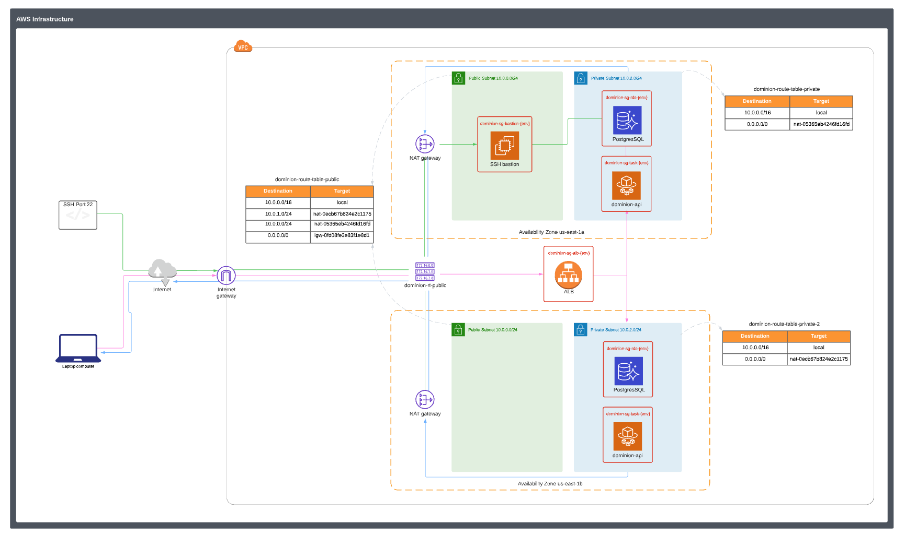

# Terraform template for AWS ECS/Fargate

This terraform setup can be used to setup the AWS infrastructure
for a dockerized application running on ECS with Fargate launch
configuration.

## Resources

This setup creates the following resources:

- VPC
- One public and one private subnet per AZ
- Routing tables for the subnets
- Internet Gateway for public subnets
- NAT gateways with attached Elastic IPs for the private subnet
- Two security groups
  - one that allows HTTP/HTTPS access
  - one that allows access to the specified container port
- An ALB + target group with listeners for port 80 and 443
- An ECR for the docker images
- An ECS cluster with a service (incl. auto scaling policies for CPU and memory usage)
  and task definition to run docker containers from the ECR (incl. IAM execution role)
- An RDS Aurora PostgreSQL Serverless v2
- An EC2 Linux Bastion Jump Host for private access to Aurora
- An S3 Bucket Website Host
- A Cloudfront Distribution
- A Cognito User Pool with 1 initial System User




### Install Terraform

- Install terraform on MacOS with `brew install terraform`
- Install TFLint `brew install tflint`

### Initialize Project
- Initialize Terraform `terraform init` 
- Initialize TFLint `tflint --init`


### Planning and Applying Changes 
1. update `dev.tfvars` file to manage secret values for different environments or projects with the same infrastructure
2. execute `terraform init` to initialize your local terraform environment and connect it to the state store and download necessary providers
3. execute `terraform plan -var-file="dev.tfvars" -out="out.plan"` - to calculate changes to apply and create a plan. Check if any of the changes are expected, especially deletion of infrastructure.
4. if everything looks good, execute your changes with `terraform apply out.plan`

### Switching Environments(Workspaces)
A Terraform workspace is a Terraform feature allowing multiple states to be associated with a single configuration.

Whenever a new workspace is created, you are automatically switched to that workspace — this can verified by terraform workspace listwhich prints a list of all available workspaces and selects the current one with an asterisk:
```
  default
* prod
```

To switch to a different workspace the `select` command can be used: 
```
terraform workspace select default[, prod]
```

### Setting up Terraform Backend

Sometimes we need to setup the Terraform Backend from Scratch, if we need to setup a completely separate set of Infrastructure or start a new project. This involves setting up a backend where Terraform keeps track of the state outside your local machine, and hooking up Terraform with AWS.
Here is a guideline:

1. Setup AWS CLI on MacOS with `brew install aws-cli`
   1. Get access key and secret from IAM for your user
   1. execute `aws configure` ... enter your key and secret
   1. find your credentials stored in files within `~/.aws` folder
1. Create s3 bucket to hold our terraform state with this command: `aws s3api create-bucket --bucket my-terraform-backend-store --region eu-central-1 --create-bucket-configuration LocationConstraint=eu-central-1`
1. Because the terraform state contains some very secret secrets, setup encryption of bucket: `aws s3api put-bucket-encryption --bucket my-terraform-backend-store --server-side-encryption-configuration "{\"Rules\":[{\"ApplyServerSideEncryptionByDefault\":{\"SSEAlgorithm\":\"AES256\"}}]}"`
1. Create IAM user for Terraform `aws iam create-user --user-name my-terraform-user`
1. Add policy to access S3 and DynamoDB access -

   - `aws iam attach-user-policy --policy-arn arn:aws:iam::aws:policy/AmazonS3FullAccess --user-name my-terraform-user`
   - `aws iam attach-user-policy --policy-arn arn:aws:iam::aws:policy/AmazonDynamoDBFullAccess --user-name my-terraform-user`

1. Create bucket policy, put against bucket `aws s3api put-bucket-policy --bucket my-terraform-backend-store --policy file://policy.json`. Here is the policy file - the actual ARNs need to be adjusted based on the output of the steps above:

   ```sh
    cat <<-EOF >> policy.json
    {
        "Statement": [
            {
                "Effect": "Allow",
                "Principal": {
                    "AWS": "arn:aws:iam::937707138518:user/my-terraform-user"
                },
                "Action": "s3:*",
                "Resource": "arn:aws:s3:::my-terraform-backend-store"
            }
        ]
    }
    EOF
   ```

1. Enable versioning in bucket with `aws s3api put-bucket-versioning --bucket terraform-remote-store --versioning-configuration Status=Enabled`
1. create the AWS access keys for your deployment user with `aws iam create-access-key --user-name my-terraform-user`, this will output access key and secret, which can be used as credentials for executing Terraform against AWS - i.e. you can put the values into the `secrets.tfvars` file
1. execute initial terraforming
1. after initial terraforming, the state lock dynamo DB table is created and can be used for all subsequent executions. Therefore, this line in `main.tf` can be un-commented:

```hcl
    # dynamodb_table = "terraform-state-lock-dynamo" - uncomment this line once the terraform-state-lock-dynamo has been terraformed
```
